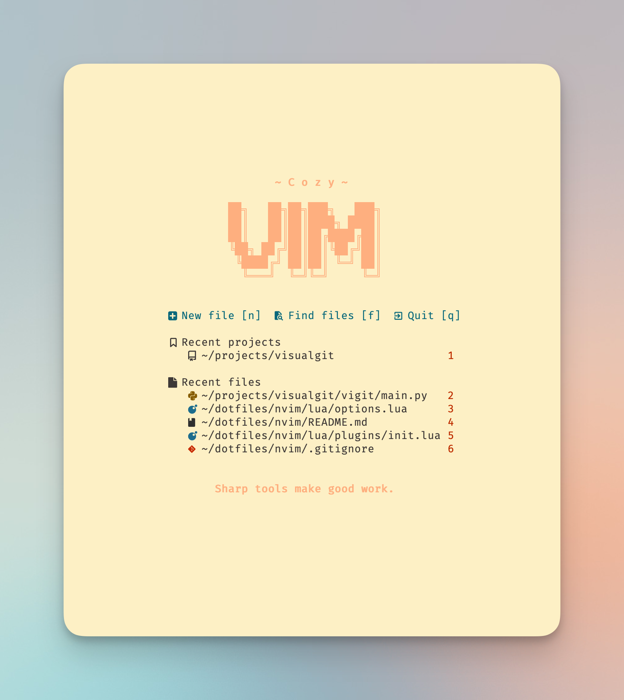
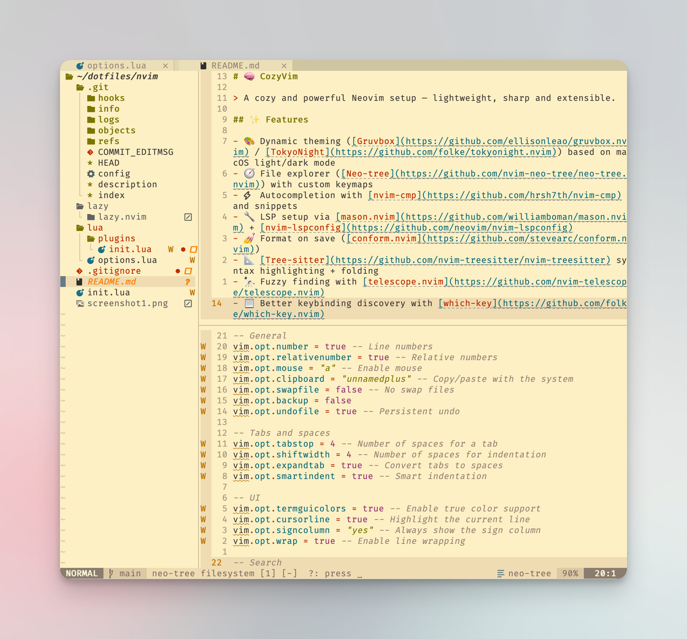

# ~ Cozy Vim ~

> A cozy and powerful Neovim setup — lightweight, sharp and extensible.

## ✨ Features

- 🎨 Dynamic theming ([Gruvbox](https://github.com/ellisonleao/gruvbox.nvim) / [TokyoNight](https://github.com/folke/tokyonight.nvim)) based on macOS light/dark mode
- 🧭 File explorer ([Neo-tree](https://github.com/nvim-neo-tree/neo-tree.nvim)) with custom keymaps
- ⚡ Autocompletion with [nvim-cmp](https://github.com/hrsh7th/nvim-cmp) and snippets
- 🔧 LSP setup via [mason.nvim](https://github.com/williamboman/mason.nvim) + [nvim-lspconfig](https://github.com/neovim/nvim-lspconfig)
- 💅 Format on save ([conform.nvim](https://github.com/stevearc/conform.nvim))
- 📐 [Tree-sitter](https://github.com/nvim-treesitter/nvim-treesitter) syntax highlighting + folding
- 🔭 Fuzzy finding with [telescope.nvim](https://github.com/nvim-telescope/telescope.nvim)
- 📋 Better keybinding discovery with [which-key](https://github.com/folke/which-key.nvim)
- 🚥 Buffer/tab navigation with [bufferline.nvim](https://github.com/akinsho/bufferline.nvim)
- 🛠️ Diagnostics and TODOs via [trouble.nvim](https://github.com/folke/trouble.nvim) and [todo-comments](https://github.com/folke/todo-comments.nvim)
- 🏠 Startup dashboard ([dashboard-nvim](https://github.com/nvimdev/dashboard-nvim)) with recent files and projects
- 💬 Smooth notifications ([noice.nvim](https://github.com/folke/noice.nvim) + [nvim-notify](https://github.com/rcarriga/nvim-notify))
- 🎮 Custom keymaps for fast navigation, folding, splits and more

## 🚀 Install

> Install requires Neovim 0.9+. Always review the code before installing a configuration.

Clone the repository and install the plugins:

```sh
git clone git@github.com:alexaldearroyo/cozyvim ~/.config/alexaldearroyo/cozyvim
```

Open Neovim with this config:

```sh
NVIM_APPNAME=alexaldearroyo/cozyvim/ nvim
```

Plugins are managed with [lazy.nvim](https://github.com/folke/lazy.nvim) — bootstrap happens automatically.

## 📸 Preview




## 🗝 Custom Keybindings

<details>
<summary>Toggle List</summary>

| Shortcut        | Action                      |
| --------------- | --------------------------- |
| `<leader>e`     | Toggle Neo-tree             |
| `<leader>ff`    | Find files (Telescope)      |
| `<leader>fg`    | Live grep (Telescope)       |
| `<leader>fb`    | Buffers (Telescope)         |
| `<leader>fh`    | Help tags (Telescope)       |
| `<leader>w`     | Save buffer                 |
| `<leader>x`     | Close buffer                |
| `<leader>q`     | Quit with confirm if needed |
| `<leader>Q`     | Quit all (with confirm)     |
| `<Tab>`         | Next buffer                 |
| `<S-Tab>`       | Previous buffer             |
| `zh/zx`         | Fold current block          |
| `zl/zo`         | Unfold current block        |
| `zu`            | Unfold all                  |
| `za`            | Fold all                    |
| `<leader>sj/sk` | Split vertically            |
| `<leader>sh/sl` | Split horizontally          |
| `<leader>sx`    | Close split                 |
| `<C-h/j/k/l>`   | Move between splits         |
| `§` / `±`       | Start / Top of file         |
| `0` / `)`       | End / Bottom of file        |
| `\`             | Match brackets/blocks       |
| `<leader>k`     | Scroll up (half page)       |
| `<leader>j`     | Scroll down (half page)     |

</details>

## ⚙ Requirements

### 🔒 Required

- [Neovim](https://neovim.io/) ≥ 0.9 — core editor
- [git](https://git-scm.com/) — plugin management with lazy.nvim
- [ripgrep](https://github.com/BurntSushi/ripgrep) — required for Telescope live grep
- [fd](https://github.com/sharkdp/fd) — faster file search for Telescope

### ✅ Recommended

- [node.js](https://nodejs.org/) — needed for LSPs like `tsserver`, `pyright`, etc.
- [stylua](https://github.com/JohnnyMorganz/StyLua) — Lua formatter (used by Conform)
- [black](https://github.com/psf/black) — Python formatter
- [rubocop](https://github.com/rubocop/rubocop) — Ruby formatter
- [prettier](https://prettier.io/) — JS/TS/CSS/JSON formatter
- [Nerd Fonts](https://www.nerdfonts.com/) — icons in statusline, bufferline, dashboard, etc.

---

<p align="center">© 2025 Alex Arroyo</p>
